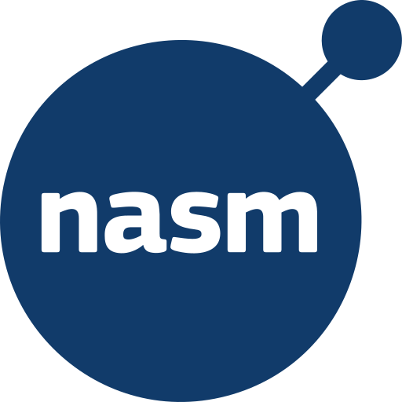
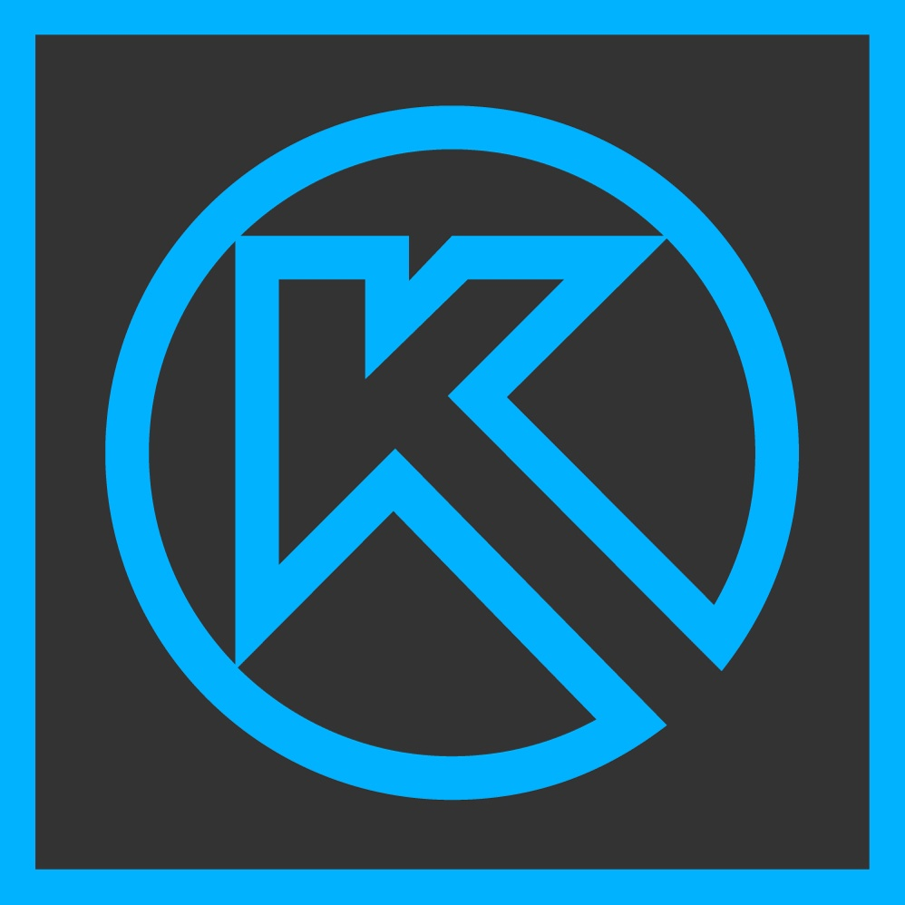

# About me

I create open source software and hardware projects, mainly using Python and C++. I am also interested in ethical hacking and participate in CTF.

## My skills

- Low- and high-level programming
- Microcontrollers programming
- Information security, ethical hacking, CTF
- Hardware, schematic and PCB design

### Languages

&ensp;&ensp;&ensp;&ensp;&ensp;&ensp;&ensp;&ensp;&ensp;

### Web libraries and frameworks

&ensp;&ensp;

### Tools and software

&ensp;&ensp;&ensp;&ensp;&ensp;

### Hardware

&ensp;
### Information security, CTF

&ensp;&ensp;&ensp;&ensp;&ensp;&ensp;

### Other languages and tools

&ensp;&ensp;&ensp;

### CTF

&nbsp;WEB  
&nbsp;PWN (binary exploitation)

## Featured projects

**[RingBuf-c](https://github.com/t1m013y/RingBuf-c)**&nbsp;&nbsp;&nbsp;  
C library: A ring buffer (FIFO) for C and C++

**[PIDctrl-c](https://github.com/t1m013y/PIDctrl-c)**&nbsp;&nbsp;&nbsp;  
C library: PID controller for C and C++

**[QR-code-generator-Firefox](https://github.com/t1m013y/QR-code-generator-Firefox)**&nbsp;&nbsp;&nbsp;  
Extension for generating QR codes in Firefox

<!-- ## Planned projects  -->   <!-- I will add this section later -->

## GitHub stats

## Contacts

Email: [t1m013y@gmail.com](mailto:t1m013y@gmail.com)  
Telegram: [@FominTimofey](https://t.me/FominTimofey)  
Discord: `@t1m013y`
